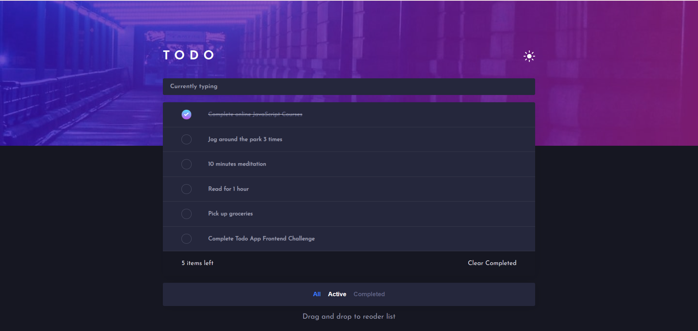
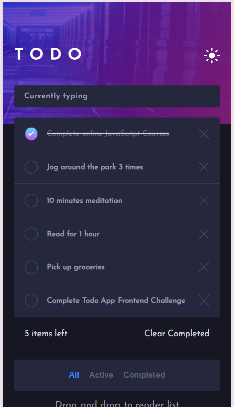
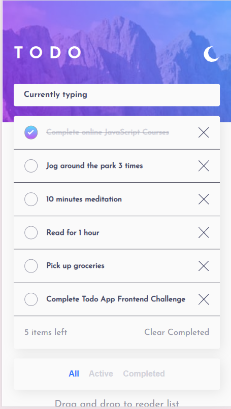

# 📝 Todo App

A modern, responsive Todo application built with React to consolidate my understanding of the library through a complete, real-world project.

Rather than simply recreating a Todo application, this project was an opportunity to apply React fundamentals, improve my problem-solving skills, and build an interactive user interface from scratch.

> **Project Status:** ✔️ Core features completed (≈90%)
> Planned improvements include drag-and-drop reordering and local data persistence using Local Storage.

---

##  Table of Contents

* [Features](#features)
* [Planned Improvements](#planned-improvements)
* [Tech Stack](#tech-stack)
* [What I Learned](#what-i-learned)
* [Installation](#installation)
* [Preview](#preview)
* [Author](#author)

---

## Features

Users can:

* ✅ Add new todos
* ✅ Mark todos as completed
* ✅ Delete todos
* ✅ Filter todos by:

  * All
  * Active
  * Completed
* ✅ Clear all completed todos
* ✅ Toggle between light and dark themes
* ✅ Responsive design for desktop and mobile devices
* ✅ Hover states for interactive elements

---

## Planned Improvements

The following features will be added in future updates:

* 🔄 Drag-and-drop support to reorder tasks
* 💾 Persist todos using Local Storage so data remains after refreshing the page

---

## Tech Stack

* React v19.2
* JavaScript (ES6+)
* HTML5
* CSS3
* Vite

---

## What I Learned

This project allowed me to strengthen my understanding of:

* Component-based architecture
* React state management with `useState`
* Props and component communication
* Event handling
* Conditional rendering
* Rendering dynamic lists
* Responsive UI development
* Organizing a React project
* Debugging and solving UI issues

More importantly, it taught me how to break down a complete application into reusable components and progressively build features while maintaining clean code.

---

## Installation

```bash
git clone https://github.com/NgohBuilds/react-learning-project.git

cd Todo_App

npm install

npm run dev
```

---

## Preview

### Desktop View



### Mobile View





---

## Author

**Gabriel Ngoh**

Master's student in Computer Science (MIAGE), specializing in **Management Information Systems and Application Engineering (MSIIA)**.

Passionate about software engineering and artificial intelligence, I enjoy building projects that strengthen my skills in frontend and backend development while continuously improving my problem-solving and software design abilities.

My long-term goal is to become a Software Engineer with a specialization in Artificial Intelligence, building intelligent, scalable, and impactful software solutions.
